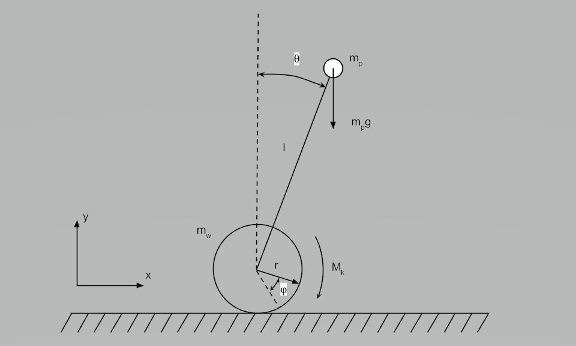
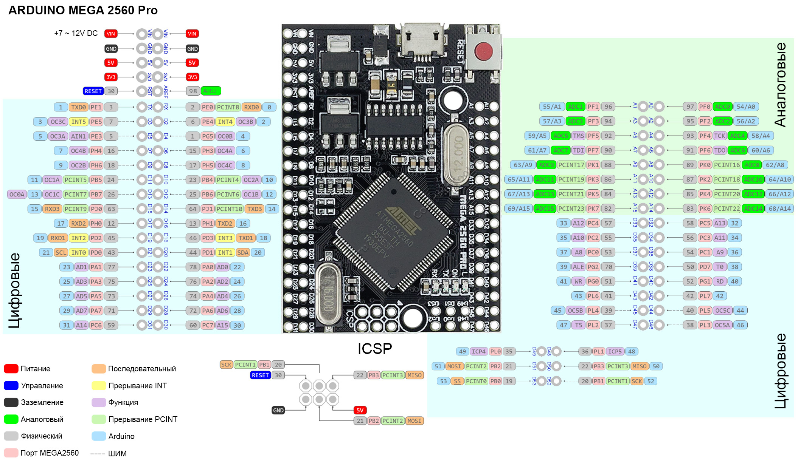
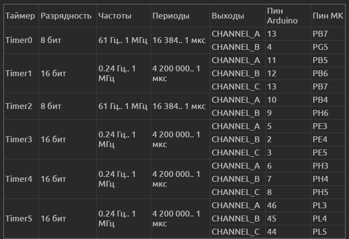
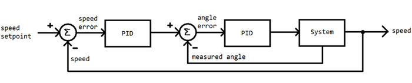

# Балансирующий робот. Версия 2

Ранее я уже собирал балансирующего робота, но делал это с помощью двух двигателей постоянного тока, в этот раз я хотел использовать шаговые двигатели, что бы лучше разобраться с их принципом работы. Репозиторий возможно будет дополняться и обрастать новыми программами и материалом. 
Видео о данном роботе можно посмотреть по ссылке:

## Структура проекта:
- balansing_robot: папка в которой храняться самые акутальные программы в которых все уже настроено и работает
- body: 3D модель робота, можно использовать для изготовления
- IMU: некоторые полезные программы для работы с IMU датчиком MPU-6050(MPU9250 тоже может использовать эти программы)
- stepper_motor_setup: программа для проверки того как работают шаговые двигатели через Arduino с помощью внутренних таймеров
- image: изображения для статьи
- electronic.pdf электрическая схема проекта

## Общая теория
Ссылка на неплохую статью про балансирующего робота: https://habr.com/ru/post/220989/

Выше приведена кинематическая схема балансирующего робота
Еще схему такого робота называют "обратный маятник", думаю не сложно догадаться почему
Здесь есть 1 важное допущение, что мы принебрегаем массой робота и считаем, что вся масса робота сосредоточена сверху, что на самом деле не так.
Вся масса робота распределена по корпусу и если мы хотим учитывать все массы и их смещения, то это потянет как минимум на неплохую научную работу. 

Здесь нас интересует больше практическая часть данного робота и вот какие выводы я сделал при сборке данной модели:
1. Необходимо все тяжелые элементы робота смещать вниз, ближе к колесам, сверху ставим наиболее легкие элементы
2. Корпус делаем как можно более легким но жестким, везде где можно экономим массу
3. IMU датчик ставим как можно выше, но таким образом чтобы он распологался на центральной оси робота
4. Если робот уже получился тяжелым, особого смысла ставить на него более сильные шаговые двигатели нет, так как масса увеличится пропорционально мощности
5. Не стараемся перегружать преобразователи напряжения, лучше поставить 2, но чтобы каждый из них работал на 50% от максимума своей мощности
6. Силовые провода берем толстые, так как потреблемение тока будет ~ 5-7А, 
7. Каждый отдельный шаговый двигатель настроен на ток в 2.5\3А и микрошаг в 16, включены 3 и 6 тумблер на TB6600 
8. Колеса чем больше диаметр - тем лучше, но нужно стараться колеса брать с хорошим контактом к поверхности, но при этом достаточно жесткие, чтобы под массой робота колеса имели минимальную деформацию. 

## Arduino 
Не каждая плата сможет управлять таким роботом, особенно управлять независимо двумя шаговыми двигателями. Есть некоторые библиотеки которые могут это сделать, но с этими библиотеками не конектится IMU датчик, а значит все зря.
Вот список тех плат на которых можно собрать робота балансира:
- Arduino Mega2560 
- Arduino Pro Micro

Для того чтобы лучше понимать, что такое таймеры и какое у них преимущество рекомендую вот эти ресурсы к прочтению: 
- https://habr.com/ru/post/453276/
- https://microkontroller.ru/arduino-projects/rukovodstvo-po-tajmeram-arduino-dlya-nachinayushhih/

Так же держите всегда под рукой, изображение с распиновкой Arduino на которой указаны таймеры: 

А так же карту таймеров в конкретной модели Arduino:

## PID
Настройка ПИД-регулятора ключевой момент на котором было потрачено очень много времени, перед тем как с опишу процесс найстройки программы, стоит сказать о том как устроен ПИД-регулятор, для этого приведу следующую схему: 

В данном проекте используется сразу два ПИД-регулятора
1. Отвечает за установку необходимой скорости движения, будь то нулевая скорость, если робот должен стоять на месте, либо N-скорость для того чтобы робот начал движение
2. Принимает на вход заданный угол отклонения и сравнивает его с текущем углом отклонения, пытаясь минимизировать разницу

С такой системой регулировани уже можно работать, то в моей случае выходной результат от ПИД-регуляторов я отправил в комплементарный фильтр, для того чтобы сделать движение более плавный и убрать мелкую тряску при стабилизации.

